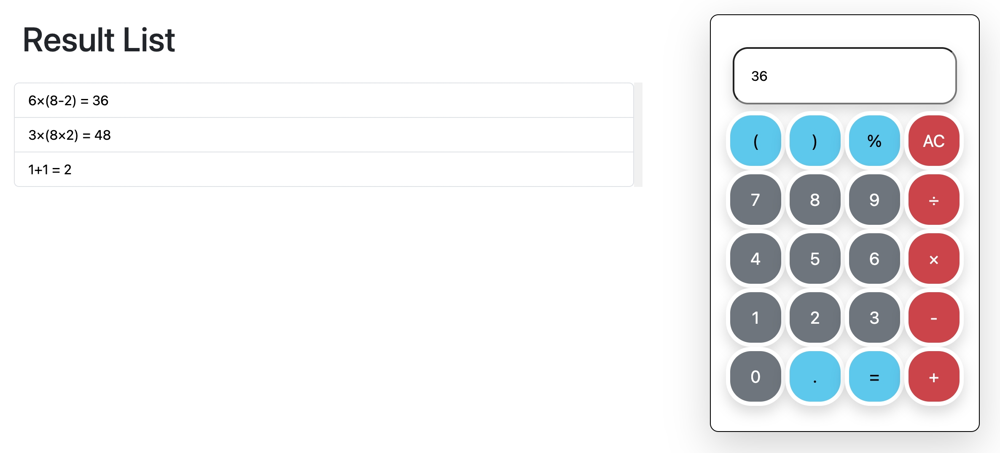

# Vue Calculator


一個使用 Vue 3 和 Vite 構建的現代化計算器應用，具有計算歷史記錄功能和精確的數學運算。
[Demo](http://daniel.pages.nilm.cc/vue-calculator)


<p align="center">
  
</p>

## ✨ 功能特色

- 📱 響應式設計，適配桌面和移動設備
- 🧮 支持基本的數學運算（加、減、乘、除）
- 📊 支持百分比計算
- 🔄 支持嵌套括號的複雜表達式
- 📝 保存計算歷史，可點擊歷史記錄重複計算
- 🔢 使用 Decimal.js 保證高精度計算，避免浮點數誤差
- 🎨 美觀的 UI 設計，使用 Bootstrap 5 構建

## 🚀 技術棧

- **前端框架**: Vue 3 (Composition API)
- **構建工具**: Vite
- **UI 框架**: Bootstrap 5
- **數學運算庫**: Decimal.js
- **代碼格式化**: ESLint + Prettier

## 📋 先決條件

在開始之前，請確保您的系統上已安裝：

- Node.js (>= 14.18.0 或 >= 16.0.0 推薦)
- npm 或 yarn

## 🛠️ 安裝與設置

1. 克隆倉庫

```bash
git clone https://github.com/your-username/vue-calculator.git
cd vue-calculator
```

2. 安裝依賴

```bash
npm install
# 或
yarn install
```

3. 啟動開發服務器

```bash
npm run dev
# 或
yarn dev
```

應用將在 http://localhost:5173 運行（或系統提供的其他可用端口）。

## 🔧 開發指南

### 在指定主機（IP）上運行開發服務器

如果您希望在虛擬機或VPS上構建此項目，您可以使用以下命令在指定的主機上運行開發服務器：

```bash
npm run dev -- --host=0.0.0.0
# 或
yarn dev --host=0.0.0.0
```

### 構建生產版本

```bash
npm run build
# 或
yarn build
```

生成的文件將位於 `public` 目錄中。

### 預覽生產構建

在部署之前，您可以本地預覽生產構建：

```bash
npm run preview
# 或
yarn preview
```

### 代碼檢查 (Lint)

```bash
npm run lint
# 或
yarn lint
```

## 📚 使用指南

1. 使用數字鍵和運算符輸入表達式
2. 支持括號 `(` 和 `)` 處理複雜表達式
3. 使用 `%` 計算百分比
4. 按 `=` 計算結果
5. 按 `AC` 清除當前輸入
6. 查看並點擊歷史記錄以重用先前的計算

## 🧩 主要功能

### 複雜表達式計算

支持處理帶有括號的複雜嵌套表達式，如：
```
(2 + 3) × (4 - 1)
```

### 高精度計算

使用 Decimal.js 庫進行高精度數學運算，避免 JavaScript 浮點計算的精度問題。例如：
```
0.1 + 0.2 = 0.3 (而不是 0.30000000000000004)
```

### 計算歷史

自動保存計算歷史，允許用戶點擊歷史記錄中的項目重用先前的計算。

## 📜 許可證

本項目採用 [MIT 許可證](LICENSE)。

